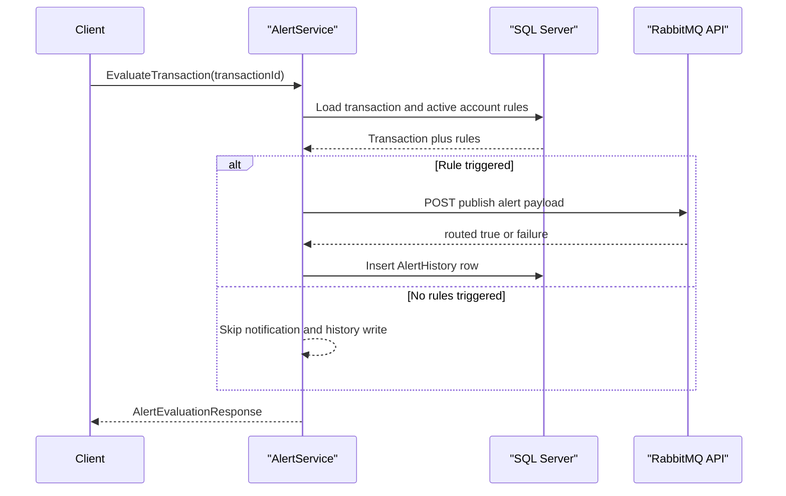

# API & Service Communication Contracts

The application exposes a compact SOAP API surface through a single WCF service and performs synchronous SQL and HTTP-based integration for alert processing.

## Service Catalog

| Service | Port | Category | Purpose |
|---|---|---|---|
| ZavaAlertService | IIS/WCF host port (not fixed in repo) | Business | Evaluates transaction alerts and manages account alert rules |
| Health handler | Same host port (`/health`) | Observability | Liveness endpoint returning `OK` |

## API Endpoints Inventory

| Service | Method | Path | Request Type | Response Type |
|---|---|---|---|---|
| IAlertService | SOAP Operation | `EvaluateTransaction` | `transactionId` (long) | `AlertEvaluationResponse` |
| IAlertService | SOAP Operation | `GetAlertRules` | `accountId` (int) | `AlertRulesResponse` |
| IAlertService | SOAP Operation | `CreateAlertRule` | `AlertRuleDefinition` | `AlertRuleMutationResponse` |
| IAlertService | SOAP Operation | `UpdateAlertRule` | `ruleId` (int), `AlertRuleDefinition` | `AlertRuleMutationResponse` |

## Management & Observability Endpoints

| Service | Endpoint | Custom Metrics (if any) |
|---|---|---|
| Health handler | `GET /health` | None detected |
| WCF metadata | `GET /ZavaAlertService.svc?wsdl` | None detected |

## DTOs & Contracts

Contracts are defined in `IAlertService` and `AlertContracts.cs` with `DataContract` models: `AlertRuleDefinition` (request model for rule create/update), `AlertRuleInfo` and `AlertRulesResponse` (rule retrieval response), `AlertEvaluationResponse` (evaluation result), and `AlertRuleMutationResponse` (mutation result). `EvaluatedRule` and `AlertEvent` are internal service-level models used during processing/publishing. Serialization uses WCF DataContract serialization plus `JavaScriptSerializer` for RabbitMQ payload emission.

## Communication Patterns

Communication is synchronous from client to WCF service and from service to SQL Server over ADO.NET. Alert notification uses a synchronous HTTP POST to RabbitMQ Management API and behaves as asynchronous business delivery once accepted by RabbitMQ. No explicit retry, timeout policy, circuit breaker, service discovery, or API gateway is implemented. No TLS/authz enforcement is configured at the service contract layer in this repository; health endpoint is explicitly public and RabbitMQ uses basic auth credentials from environment variables.

## Service Technology Matrix

| Service | Web | Data Access | Discovery | Gateway | Actuator | Cache | Metrics |
|---|---|---|---|---|---|---|---|
| ZavaAlertService | WCF SOAP | ADO.NET SqlClient | None | None | No | None | None |
| Health handler | ASP.NET handler | None | None | None | Custom health path | None | None |

## Service Communication Sequence

