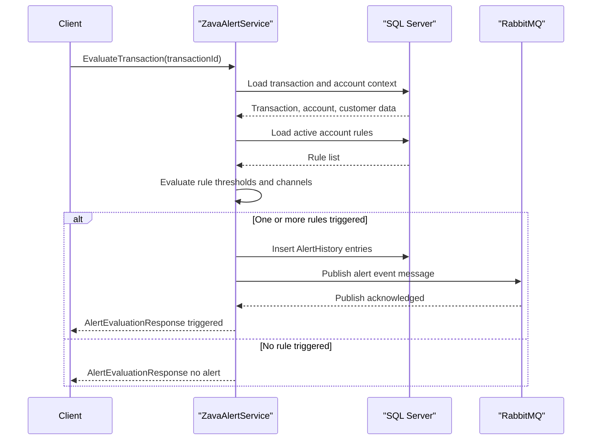

# API & Service Communication Contracts

The service exposes a small SOAP API surface with four operations and uses synchronous SQL access plus asynchronous RabbitMQ publication for triggered alerts.

## Service Catalog

| Service | Port | Category | Purpose |
|---|---:|---|---|
| ZavaAlertService (WCF) | 8080 | Business | Evaluates transactions, manages alert rules, and returns rule/query responses |
| SQL Server container | 1433 | Infrastructure | Stores accounts, transactions, and alert rule state |
| RabbitMQ container | 5672 | Infrastructure | Receives triggered alert events |

## API Endpoints Inventory

| Service | Method | Path | Request Type | Response Type |
|---|---|---|---|---|
| ZavaAlertService | SOAP Operation | /ZavaAlertService.svc (EvaluateTransaction) | `long transactionId` | `AlertEvaluationResponse` |
| ZavaAlertService | SOAP Operation | /ZavaAlertService.svc (GetAlertRules) | `int accountId` | `AlertRulesResponse` |
| ZavaAlertService | SOAP Operation | /ZavaAlertService.svc (CreateAlertRule) | `AlertRuleDefinition` | `AlertRuleMutationResponse` |
| ZavaAlertService | SOAP Operation | /ZavaAlertService.svc (UpdateAlertRule) | `int ruleId`, `AlertRuleDefinition` | `AlertRuleMutationResponse` |

## Management & Observability Endpoints

| Service | Endpoint | Custom Metrics (if any) |
|---|---|---|
| ZavaAlertService | `/Health.ashx` | None detected |
| ZavaAlertService | `/ZavaAlertService.svc?wsdl` | None detected |

## DTOs & Contracts

The contract is defined by `IAlertService` and `AlertTypes` data contracts. API request/response types include `AlertRuleDefinition`, `AlertRulesResponse`, `AlertRuleInfo`, `AlertEvaluationResponse`, and `AlertRuleMutationResponse`. DTOs are mutable class-based WCF `DataContract` types serialized through the default .NET data contract serializer; no OpenAPI, GraphQL, or protobuf schema was detected.

## Communication Patterns

Synchronous communication uses SOAP to the service boundary and direct SQL calls to SQL Server. Asynchronous communication uses RabbitMQ queue publication (`alerts.triggered`) after successful rule evaluation. No circuit breaker, retry policy, or explicit timeout policy was found in the service code. No API gateway or service discovery mechanism was detected. Security posture at API layer is minimal: no TLS termination, authentication, or authorization controls are configured in service contracts or host configuration.

## Service Technology Matrix

| Service | Web | Data Access | Discovery | Gateway | Actuator | Cache | Metrics |
|---|---|---|---|---|---|---|---|
| ZavaAlertService | WCF SOAP | ADO.NET SqlClient | None | No | Health handler only | None | None |
| SQL Server | N/A | N/A | None | No | N/A | N/A | N/A |
| RabbitMQ | N/A | N/A | None | No | Management UI available | N/A | N/A |

## Service Communication Sequence

