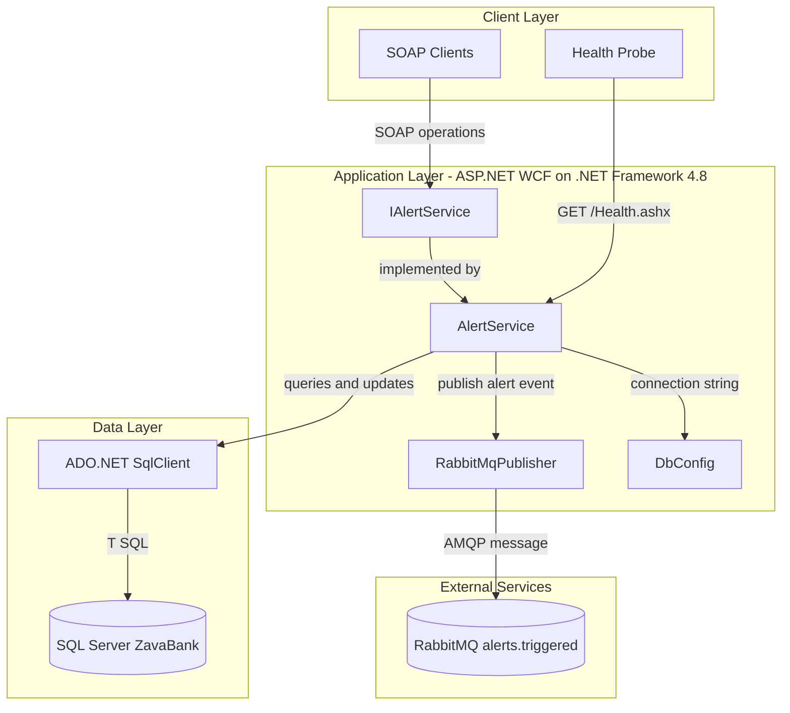
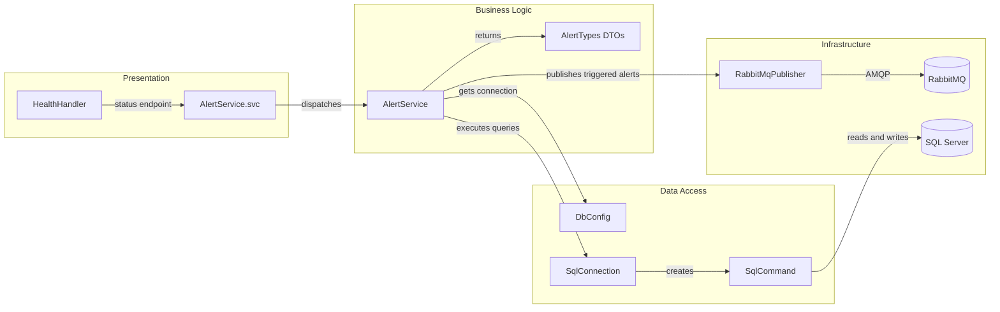

# Architecture Diagram

This application is a single .NET Framework WCF service that evaluates banking alerts, persists state in SQL Server, and publishes alert events to RabbitMQ.

## Application Architecture

### Technology Stack Summary

| Layer | Technology | Version | Purpose |
|---|---|---|---|
| Presentation | ASP.NET WCF | .NET Framework 4.8 | Exposes SOAP service operations |
| Business | AlertService class | N/A | Evaluates rules and orchestrates persistence and messaging |
| Data Access | System.Data.SqlClient | .NET Framework | Executes SQL commands against SQL Server |
| Messaging | RabbitMQ.Client | Runtime package | Publishes triggered alert events |
| Runtime | Docker + Mono image | mono:6.12 | Containerized hosting |

### Data Storage & External Services

The service uses a single SQL Server database (`ZavaBank`) as the system of record for accounts, transactions, and alert rules. It integrates with RabbitMQ for asynchronous alert publication after rule evaluation.

### Key Architectural Decisions

- Uses a single deployable WCF service boundary with direct SQL access instead of repository abstractions.
- Performs synchronous transactional checks in-process, then emits asynchronous notifications via RabbitMQ.
- Keeps configuration externalized in `Web.config` and `App.config` for DB and messaging endpoints.

## Component Relationships

### Component Inventory

| Component | Layer | Type | Responsibility |
|---|---|---|---|
| AlertService.svc | Presentation | WCF service host | Exposes SOAP endpoint |
| AlertService | Business Logic | Service class | Core rule evaluation and mutation operations |
| AlertTypes | Business Logic | DTO/data contracts | Request and response contracts |
| DbConfig | Data Access | Config helper | Resolves SQL connection string |
| SqlConnection/SqlCommand usage | Data Access | ADO.NET access | Executes all persistence operations |
| RabbitMqPublisher | Infrastructure | Messaging adapter | Declares queue and publishes persistent messages |
| HealthHandler | Presentation | HTTP handler | Lightweight readiness endpoint |
