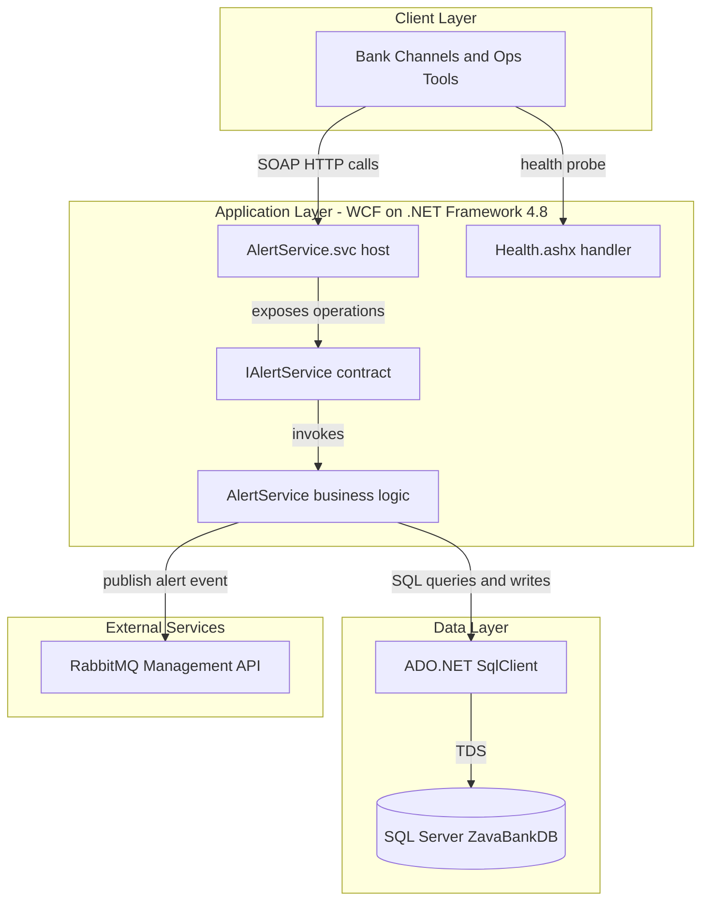
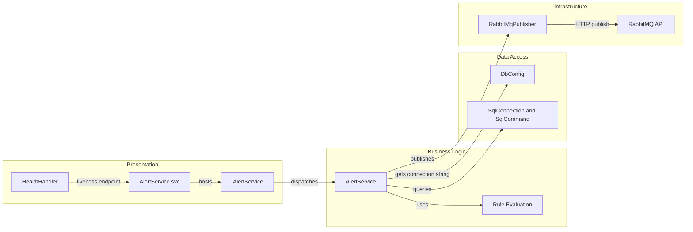

# Architecture Diagram

This repository contains a single .NET Framework WCF service for evaluating banking alert rules and managing account alert configuration.

## Application Architecture

### Technology Stack Summary

| Layer | Technology | Version | Purpose |
|---|---|---|---|
| Service Host | WCF (System.ServiceModel) | .NET Framework 4.8 | Exposes SOAP operations |
| Business Logic | C# service class | .NET Framework 4.8 | Evaluates transaction alerts and rule mutations |
| Data Access | System.Data.SqlClient | Framework inbox | Executes SQL against core banking tables |
| External Integration | RabbitMQ HTTP API | Configured at runtime | Sends alert notifications |

### Data Storage & External Services

The service uses SQL Server as the system of record for transactions, account alert rules, and alert history, and it calls RabbitMQ's management publish API to fan out triggered alerts.

### Key Architectural Decisions

- Keeps all domain orchestration in a single WCF service class (`AlertService`).
- Uses direct SQL statements via ADO.NET instead of an ORM abstraction.
- Uses an internal publisher wrapper for RabbitMQ communication to isolate outbound integration logic.

## Component Relationships

### Component Inventory

| Component | Layer | Type | Responsibility |
|---|---|---|---|
| AlertService.svc | Presentation | WCF host endpoint | Hosts SOAP contract endpoint |
| IAlertService | Presentation | Service contract interface | Defines public operations |
| AlertService | Business Logic | Service class | Executes evaluation, read, create, and update flows |
| DbConfig | Data Access | Config helper | Resolves SQL connection string from env/config |
| SqlConnection/SqlCommand usage | Data Access | ADO.NET access | Runs SQL for rules, transactions, and history |
| RabbitMqPublisher | Infrastructure | Integration client | Sends alert events to RabbitMQ API |
| HealthHandler | Presentation | HTTP handler | Returns simple health response |
