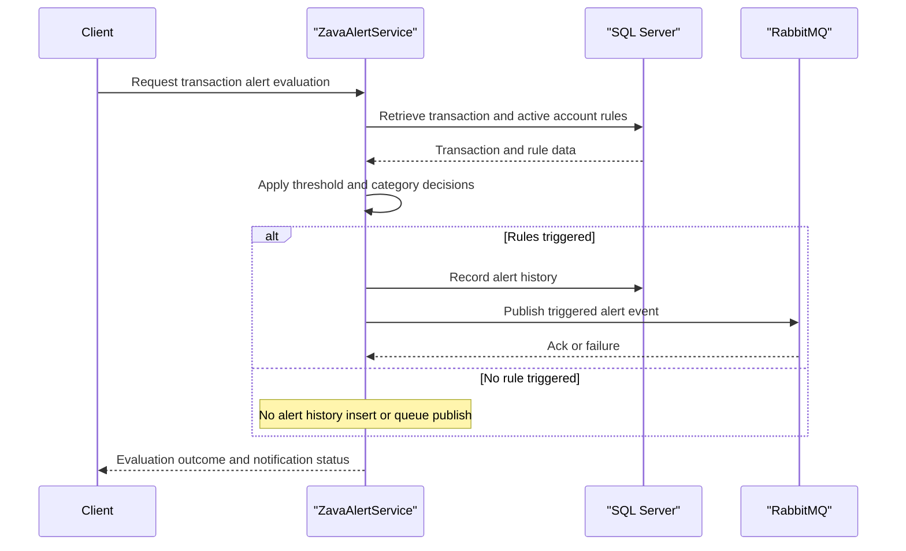

# Core Business Workflows

The application’s core domain is transaction alerting for bank accounts, including rule evaluation, rule administration, and event emission when thresholds are breached.

## Domain Entities

| Entity | Service / Bounded Context | Description | Key Relationships |
|---|---|---|---|
| Customer | Alert Management | Bank customer owning one or more accounts | Customer owns Accounts |
| Account | Alert Management | Financial account monitored by rules | Account has Transactions and AccountAlerts |
| Transaction | Alert Evaluation | Monetary event evaluated against configured rules | Transaction may create AlertHistory |
| AlertRule | Alert Configuration | Reusable rule template with threshold and category | Rule linked to Accounts via AccountAlerts |
| AccountAlert | Alert Configuration | Account-specific activation of a rule | Connects Account and AlertRule |
| AlertHistory | Alert Audit | Historical record of triggered alerts | References Transaction, Account, and Rule |

## Service-to-Domain Mapping

| Service | Domain Context | Owned Entities | External Dependencies |
|---|---|---|---|
| ZavaAlertService | Alert Evaluation and Configuration | Customer, Account, Transaction, AlertRule, AccountAlert, AlertHistory | SQL Server, RabbitMQ |

## Primary Workflows

### Workflow 1: Evaluate Transaction Alerts

1. Client submits `EvaluateTransaction` with a transaction ID.
2. Service loads transaction, account, and customer context.
3. Service loads enabled account rules and evaluates thresholds.
4. For each triggered rule, service writes `AlertHistory` and publishes an event to queue.
5. Service returns evaluation response with triggered rule codes and publish status.

### Workflow 2: Manage Alert Rules

1. Client submits `CreateAlertRule` or `UpdateAlertRule` with rule definition.
2. Service validates required identifiers and rule metadata.
3. Service inserts or updates rule records and account mappings.
4. Service returns mutation result with message and affected rule IDs.

## Cross-Service Data Flows

Cross-service composition is simple and unidirectional: the service reads/writes SQL data and optionally pushes events to RabbitMQ for downstream consumers. If RabbitMQ publication fails, the workflow still returns to caller with publish status indicating failure, preserving rule-evaluation business result while signaling degraded notification propagation.

## Business Workflow Sequence

## Business Rules & Decision Logic

- Transaction ID must be positive and must exist before evaluation proceeds.
- Rule definitions require non-empty name and code; account-scoped operations require account and customer IDs.
- Rule decision logic supports threshold categories including high transaction, daily spend, daily count, monthly spend, and low balance checks.
- Alert history is recorded only for triggered rules; notification publication is best effort and surfaced in response state.
