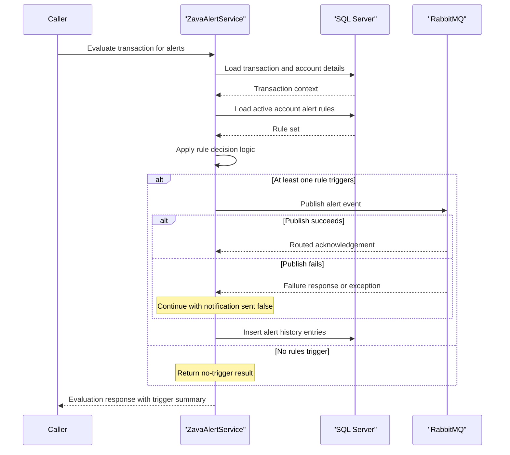

# Core Business Workflows

The application supports bank alert operations by evaluating transactions against configured rules and managing per-account alert settings.

## Domain Entities

| Entity | Service / Bounded Context | Description | Key Relationships |
|---|---|---|---|
| Transaction | Core Banking / Alert Evaluation | Financial activity event evaluated for alert triggers | Linked to Account |
| Account | Core Banking / Alert Evaluation | Account context used to scope applicable alerts | Linked to AccountAlerts and Transactions |
| Alert Rule | Alert Management | Defines reusable trigger logic and default thresholds | Linked to AccountAlerts |
| Account Alert | Alert Management | Account-specific activation and threshold settings | Links Account and Alert Rule |
| Alert History Event | Alert Operations | Audit trail for each trigger evaluation/publish attempt | Linked to Account Alert |

## Service-to-Domain Mapping

| Service | Domain Context | Owned Entities | External Dependencies |
|---|---|---|---|
| ZavaAlertService | Alert Evaluation and Rule Management | Alert Rule, Account Alert, Alert History Event | SQL Server transactional/account data, RabbitMQ API |

## Primary Workflows

### Workflow 1: Evaluate Transaction Alerts

A caller submits a transaction ID for evaluation. The service validates input, loads transaction/account context, retrieves active alert rules for the account, runs rule decision logic (`LOW_BAL`, `LARGE_TXN`, `OVERDRAFT`, `INTL_WIRE`, `DAILY_SPEND`), publishes triggered events to RabbitMQ, records history, and returns an evaluation summary.

### Workflow 2: Create Account Alert Rule

A caller submits a new rule definition. The service validates required values, creates a new alert rule row, creates account-specific alert mapping, commits both changes in one SQL transaction, and returns mutation identifiers.

### Workflow 3: Update Account Alert Rule

A caller provides rule ID and update payload. The service validates request and updates the base rule, then conditionally updates or inserts the account mapping, commits transactionally, and returns update status.

## Cross-Service Data Flows

The service composes data from shared SQL tables (`Transactions`, `Accounts`, `AlertRules`, `AccountAlerts`) within one request path and emits triggered alert payloads to RabbitMQ for downstream consumers. If RabbitMQ publish fails, the workflow still completes and records notification status as not sent, so the business outcome degrades to local logging without outbound notification.

## Business Workflow Sequence

## Business Rules & Decision Logic

Key rules include mandatory positive identifiers for transaction/account inputs, required rule naming fields, and threshold-based decisions across rule codes (`LOW_BAL`, `LARGE_TXN`, `OVERDRAFT`, `INTL_WIRE`, `DAILY_SPEND`). `CreateAlertRule` and `UpdateAlertRule` execute with SQL transaction boundaries to preserve atomic updates across related tables. Failure to publish notifications does not roll back history logging; the result reflects whether notification routing succeeded.
