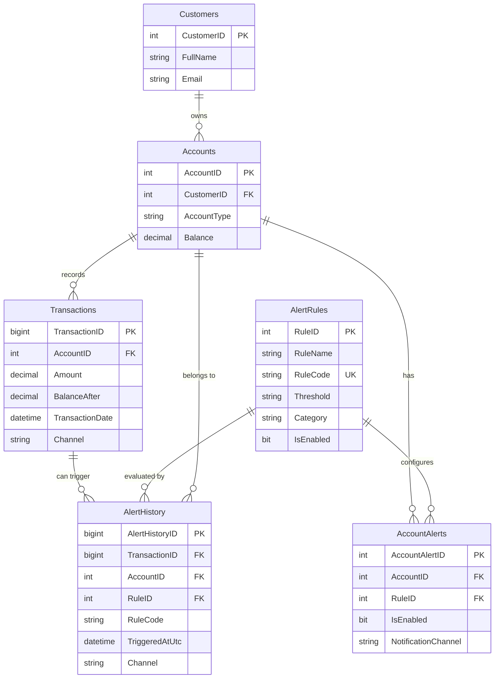

# Data Architecture & Persistence Layer

The persistence layer is SQL Server centric with direct ADO.NET access and no ORM abstraction. Core banking alert entities are managed from a single service boundary.

## Database Configuration

| Service/Module | DB Type | Profile | Driver | Connection | Migration Tool |
|---|---|---|---|---|---|
| ZavaAlertService | SQL Server | Default | System.Data.SqlClient | `DefaultConnection` in `Web.config` | SQL seed script (`seed.sql`) |

## Data Ownership per Service

| Service | Tables Owned | ORM Framework | Caching | Notes |
|---|---|---|---|---|
| ZavaAlertService | Customers, Accounts, Transactions, AlertRules, AccountAlerts, AlertHistory | ADO.NET (no ORM) | None | Single shared schema owned by one service |

## Entity Model

## Key Repository Methods

| Service | Repository | Notable Methods | Purpose |
|---|---|---|---|
| ZavaAlertService | Inline ADO.NET in `AlertService` | `EvaluateTransaction(long)`, `LoadAccountRules(...)`, `GetDailySpend(...)`, `GetDailyTransactionCount(...)`, `GetMonthlySpend(...)` | Executes threshold checks and derived aggregate queries |
| ZavaAlertService | Inline ADO.NET in `AlertService` | `GetAlertRules(int)` | Reads account-to-rule mapping and rule metadata |
| ZavaAlertService | Inline ADO.NET in `AlertService` | `CreateAlertRule(AlertRuleDefinition)`, `UpdateAlertRule(int, AlertRuleDefinition)` | Inserts and updates alert rule and account alert assignments |

## Caching Strategy

No explicit in-memory or distributed caching strategy was detected. All rule evaluation and lookup operations read from SQL Server directly for current state.

## Data Ownership Boundaries

Data ownership is centralized: one service reads and writes all domain tables in a single SQL Server database. There are no cross-service DB joins across separate services; outbound integration to RabbitMQ is event publication only and does not perform read-back aggregation from external stores.

### Data Classification & Sensitivity

| Entity | Sensitive Fields | Classification (PII/PHI/PCI/None) | Controls in Place |
|---|---|---|---|
| Customers | FullName, Email | PII | No masking or field-level controls detected in code/config |
| Accounts | AccountType, Balance | Confidential financial | No explicit encryption or masking controls detected |
| Transactions | Amount, BalanceAfter, Channel | Confidential financial | No explicit encryption or masking controls detected |
| AlertRules/AccountAlerts/AlertHistory | Rule metadata, channels | Internal | Standard DB access via connection string; no additional controls detected |
