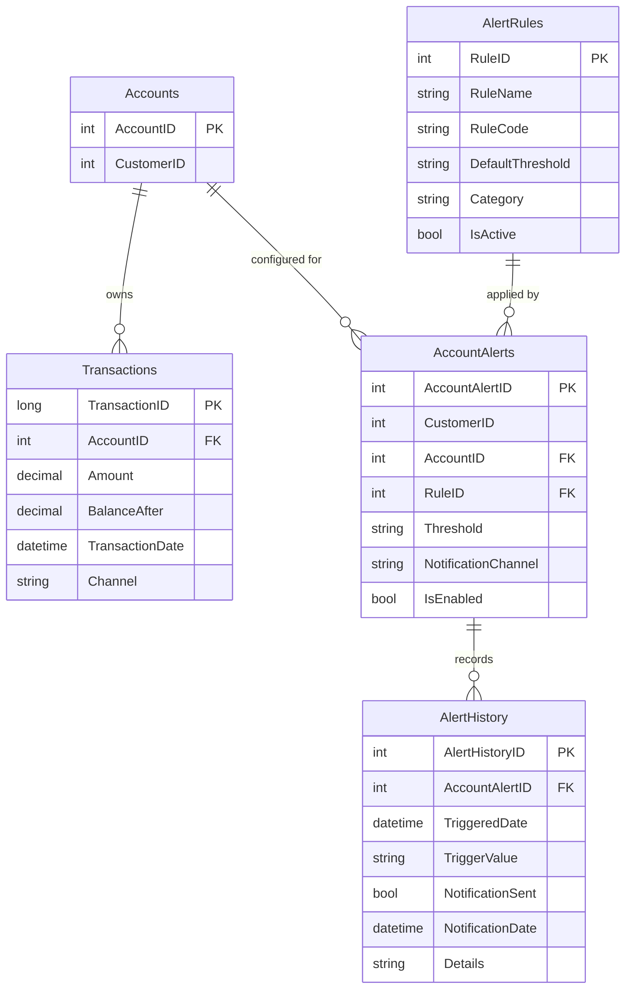

# Data Architecture & Persistence Layer

The service uses a single SQL Server database with direct ADO.NET queries and no ORM abstraction, centered on alert-rule and transaction evaluation data.

## Database Configuration

| Service/Module | DB Type | Profile | Driver | Connection | Migration Tool |
|---|---|---|---|---|---|
| ZavaAlertService | SQL Server | Default | `System.Data.SqlClient` | Env vars (`DB_*`/`DATABASE_*`) with fallback to `web.config` `ZavaBankDb` connection string | None detected |

## Data Ownership per Service

| Service | Tables Owned | ORM Framework | Caching | Notes |
|---|---|---|---|---|
| ZavaAlertService | `AlertRules`, `AccountAlerts`, `AlertHistory` (and reads `Transactions`, `Accounts`) | ADO.NET (raw SQL) | None detected | Single service directly reads/writes shared banking schema |

## Entity Model

## Key Repository Methods

| Service | Repository | Notable Methods | Purpose |
|---|---|---|---|
| ZavaAlertService | `AlertService` SQL commands | `LoadAccountRules`, transaction lookup query, history insert query | Retrieve active rules and persist evaluation results |
| ZavaAlertService | `AlertService` SQL commands | `CreateAlertRule` insert into `AlertRules` and `AccountAlerts` within transaction | Creates rule definition and account mapping atomically |
| ZavaAlertService | `AlertService` SQL commands | `UpdateAlertRule` upsert logic for `AccountAlerts` | Updates rule configuration and account linkage |
| ZavaAlertService | `AlertService` SQL commands | `GetDailySpend` aggregate query over `Transactions` by date | Computes dynamic threshold input for `DAILY_SPEND` rule |

## Caching Strategy

No application cache provider or cache-aside pattern is implemented. Reads are executed directly against SQL Server for each request, and computed alert decisions are persisted in `AlertHistory` for later analysis.

## Data Ownership Boundaries

The service operates against a shared relational store, owning alert-related tables while reading transactional/account data maintained by adjacent banking domains. Cross-domain data access is direct SQL in the same database rather than service-to-service API calls.

### Data Classification & Sensitivity

| Entity | Sensitive Fields | Classification (PII/PHI/PCI/None) | Controls in Place |
|---|---|---|---|
| Accounts | `CustomerID` | PII (identifier linkage) | No explicit masking/encryption controls in repository |
| Transactions | Amounts, channels, account linkage | Sensitive financial | No explicit masking/encryption controls in repository |
| AccountAlerts | Customer/account linkage and channels | PII | No explicit masking/encryption controls in repository |
| AlertHistory | Trigger details referencing account/rule context | Sensitive operational data | No explicit masking/encryption controls in repository |
