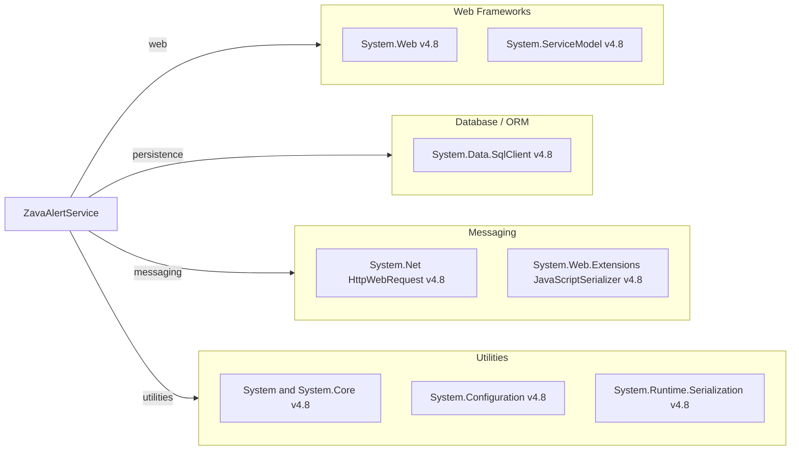

# Dependency Map

This project is a single .NET Framework service with a small declared dependency surface made up primarily of framework assemblies and platform libraries.

## Dependencies

### Dependency Summary

| Category | Count | Key Libraries | Notes |
|---|---:|---|---|
| Web Frameworks | 2 | System.Web, System.ServiceModel | Legacy ASP.NET + WCF stack on .NET Framework |
| Database / ORM | 1 | System.Data.SqlClient | Direct ADO.NET access without ORM |
| Messaging | 2 | HttpWebRequest, JavaScriptSerializer | Used to publish to RabbitMQ management API |
| Utilities | 3 | System, System.Configuration, System.Runtime.Serialization | Framework base/runtime functionality |

### Version & Compatibility Risks

The project targets .NET Framework 4.8, which is Windows-only and limits modernization options compared with modern .NET. WCF server hosting and older HTTP APIs may require architectural adjustments during migration.

### Notable Observations

- No third-party NuGet dependencies are declared in `packages.config`.
- WCF contract hosting (`System.ServiceModel`) is a primary compatibility constraint for .NET upgrade work.
- Data access is tightly coupled to raw SQL commands, increasing migration review effort.

## Test Dependencies

| Framework | Version | Notes |
|---|---|---|
| None detected | N/A | No test-scoped package declarations were found |

Total test-scope dependencies: 0
No test dependencies detected.
