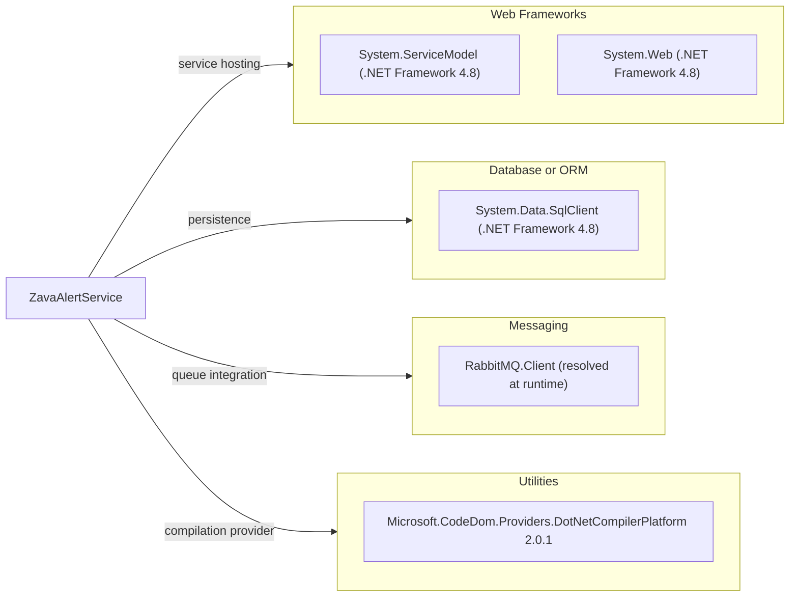

# Dependency Map

This project has a minimal dependency footprint centered on .NET Framework runtime assemblies, WCF hosting, and RabbitMQ messaging.

## Dependencies

### Dependency Summary

| Category | Count | Key Libraries | Notes |
|---|---:|---|---|
| Web Frameworks | 2 | System.Web, System.ServiceModel | WCF SOAP on ASP.NET |
| Database / ORM | 1 | System.Data.SqlClient | Direct ADO.NET SQL access |
| Messaging | 1 | RabbitMQ.Client | Alert event publication |
| Utilities | 1 | Microsoft.CodeDom.Providers.DotNetCompilerPlatform 2.0.1 | Legacy compiler provider package |

### Version & Compatibility Risks

The project targets .NET Framework 4.8 and legacy ASP.NET/WCF hosting, which limits cross-platform runtime options and requires .NET Framework targeting packs for builds. The CodeDom provider package is legacy-era and may not translate directly to modern .NET hosting models.

### Notable Observations

- Dependency declarations are sparse in project files because most framework libraries are referenced from the .NET Framework runtime.
- Messaging behavior depends on RabbitMQ runtime availability and queue durability configuration.
- No dedicated observability or security dependency packages are declared.

## Test Dependencies

| Framework | Version | Notes |
|---|---|---|
| None detected | N/A | No test-scoped dependency declarations found |

Total test-scope dependencies: 0
No test dependencies detected.
